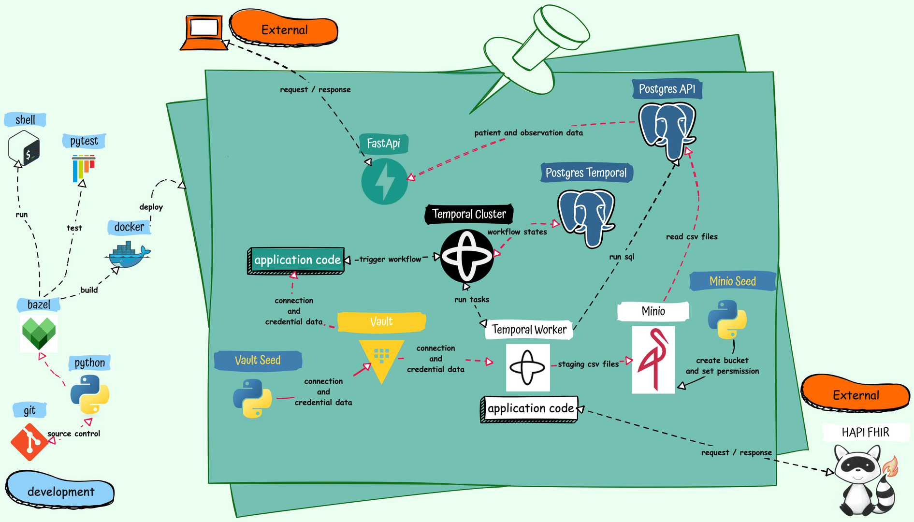
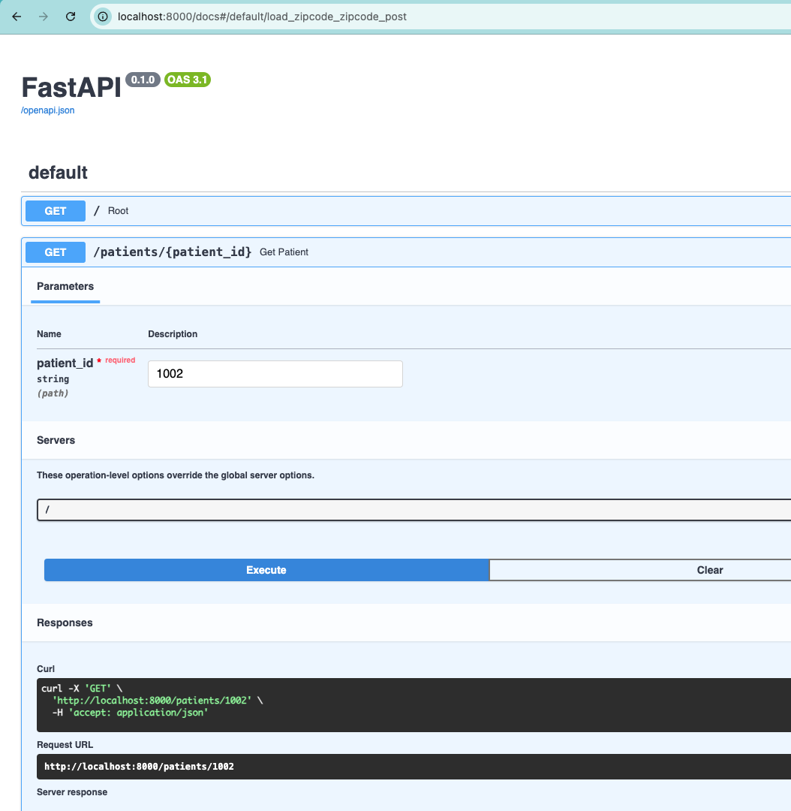
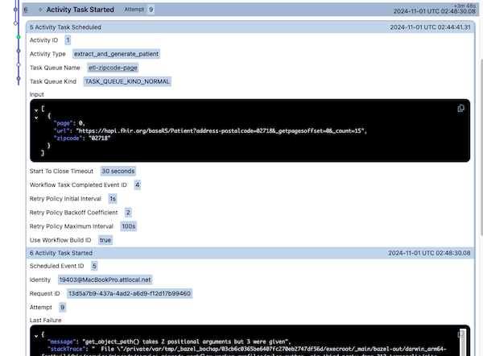
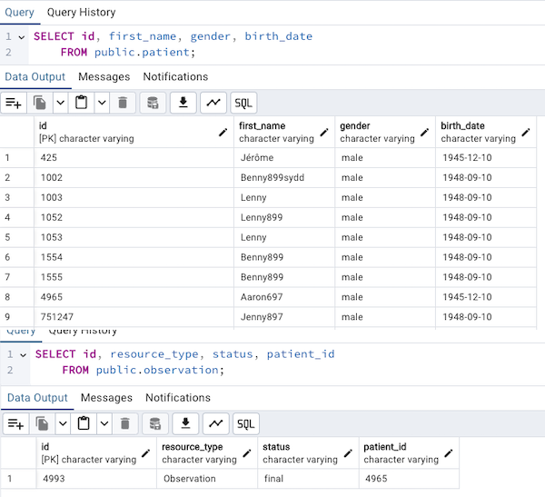
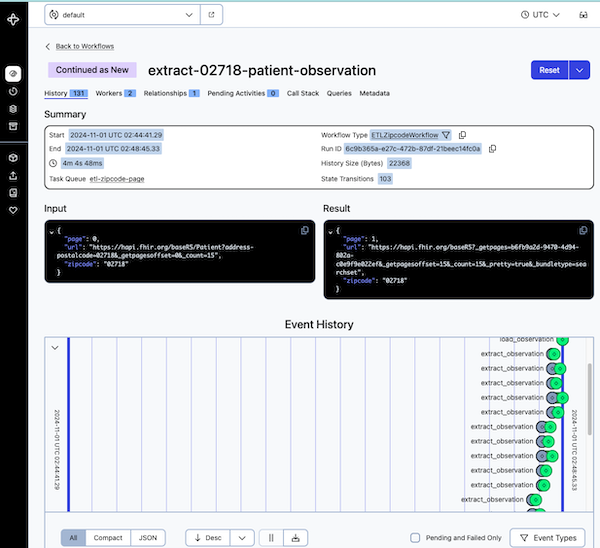

# About The Project   

This project showcases the development of a robust and efficient data pipeline. It demonstrates the ability to seamlessly integrate with external APIs to retrieve data, efficiently process and store this data in a PostgreSQL database, and expose it through user-friendly FastAPI endpoints.

The project leverages Docker for containerization, ensuring consistent and reliable deployment across different environments.  Furthermore, it employs Bazel as a build tool for configurable bundling, optimized builds, and comprehensive code testing.

To enhance data processing capabilities, the project utilizes Temporal for workflow orchestration. This enables asynchronous ETL (Extract, Transform, Load) processes with features like queuing and automatic retries, ensuring data reliability.  Finally, it integrates Minio as a scalable and efficient blob storage backend for handling large datasets and facilitating data processing.

This project effectively combines these technologies to create a comprehensive data solution that is scalable, maintainable, and fault-tolerant.

This application, built in less than a week, serves as a proof-of-concept, showcasing enterprise-level techniques for data processing and application development. While not production-grade, it offers valuable insights into these practices.

## Requirements

### Functional Requirements

1. Ingesting data for patients and observation from `HAPI FHIR API endpoints`
   1. /zipcodes
      1. POST /zipcodes {zipcode: 12345}
2. Retrieving data for patients and observation
   1. /patients
      1. /patients/[patient_id]
      2. /patient?first_name=[first_name]
   2. /observations
      1. GET /observations?patient_id=[patient_id]

### Non-Functional Requirements

1. Performance
   1. Low response time
   2. High throughput
   3. Low Latency
2. Scalability
   1. Ability to handle increasing traffic
   2. Ability to handle increasing data volumne
3. Portability
   1. Ease of moving application between environments
   2. Reversible techonology and implementation decisions
4. Reliablilty
   1. Fault tolerance
   2. Data integrity
   3. Data consistency
   4. Monitoring and logging   
5. Security
   1. Authentication and Authorization
   2. Data Protection
   3. Input Validation
   4. Output Encoding
   5. Rate Limiting
   6. Audting and logging
6. Availablity
   1. Infrastructure redundancy
   2. Error handling and fault tolerance
   3. Deployment and Maintenance
7. Maintainablity and Usability
   1. Code organization and structure
   2. API Design and documentation
   3. Versioning
   4. Testing
   5. Logging and Monitoring

## Architecture



### Code Structure

```bash
.
├── LICENSE
├── MODULE.bazel
├── MODULE.bazel.lock
├── README.md
├── WORKSPACE
├── config
│   └── docker         # docker related files 
├── docs
│   ├── design
│   │   └── images     # images usded by documentation
│   └── research
│       └── patients_and_observations.ipynb # notebook used for research
├── library
│   ├── converter
│   │   └── memory.py               # shared code to convert data into memory streams
│   ├── meta
│   │   ├── env.py                  # shared code for accessing environment variables
│   │   └── metaclass.py            # shared code for example to deal with Singleton
│   ├── orchestration               # shared temporal activities
│   ├── storage
│   │   ├── blob_minio.py           # code to manipulate minio blob storage
│   │   └── postgres.py             # code to manipulate postgre storage
│   └── webclient                   # code to manipulate external serivces like calling rest apis
├── service
│   ├── api                         # fast api code
│   ├── observation                 # extracting and manipulating observation data including temporal activities
│   ├── patient                     # extracting and manipulating patient data including temporal activities
│   └── zipcode                     # temporal activites and workflows to handle patient and observation data
├── third_party                     # requirements for allowing bazel to build code with python dependencies

└── tools
    └── runner                      # helper function to run tests
```

## Getting Started

### Prerequisites

The application makes use of supporting services for relational data (Postgres), blob (Minio), secrets (Vault) and workflow management (Temporal/ Postgres). Configuration and access information used for setting up the services are provided in an `.env` file. The format and variables required can be found in [.env.template](.env.template). The `.env` file should be placed in [config/docker/vault-seed](config/docker/vault-seed)


### Building

The application is broken into 3 different parts during the build process. The 3 parts are

1. External dependencies used by application code
This part generates the `requirements_lock.txt` and `MODULE.bazel.lock` file, this is platform dependant since the packages used in Linux and MacOS is different and are not compatible. When building docker images the command should be ran on a Linux host. [^2]
```
bazel run //:requirements.update
```
2. Shared code used by all application services
```
bazel build //library/...
```
3. Application services (API and Temporal workers)
```
bazel build //service/...
```

### Running

#### Standalone

Running via Docker compose (**Actively working to resolve imaging issues that are preventing deployment through Docker Compose. This feature will be available soon.**)
```
docker compose --env-file config/docker/vault-seed/.env -f config/docker/docker-compose.yml -f config/docker/docker-compose.overrides.yml up -d
```

#### Development on local (Requires Bazel)

1. Running supporting services (Temporal Cluster, Postgres Databases and Minio)

```
docker compose --env-file config/docker/vault-seed/.env -f config/docker/docker-compose.local.yml -f config/docker/docker-compose.local.overrides.yml up -d
```

2. Start FastAPI
```
VAULT_HOST=vault VAULT_PORT=8200 VAULT_TOKEN=unsecure4convience VAULT_PATH=supersecretlocation IS_LOCAL=1 bazel run //service/api:service_api_run
```

3. Start Temporal Worker
```
VAULT_HOST=vault VAULT_PORT=8200 VAULT_TOKEN=unsecure4convience VAULT_PATH=supersecretlocation IS_LOCAL=1 bazel run //service/zipcode:service_zipcode_workflow_worker
```

<sub>* `bazel run` doesn't provide options to provide enviroment variables as arguments. So we need to set the environment variables via the shell before runnning</sub>


#### Testing on local (Requires Bazel)

1. library tests
```
bazel test //library/... --action_env VAULT_HOST=vault --action_env VAULT_PORT=8200 --action_env VAULT_TOKEN=unsecure4convience --action_env VAULT_PATH=supersecretlocation  --action_env IS_LOCAL=1
```
2. service tests
```
bazel test //service/... --action_env VAULT_HOST=vault --action_env VAULT_PORT=8200 --action_env VAULT_TOKEN=unsecure4convience --action_env VAULT_PATH=supersecretlocation  --action_env IS_LOCAL=1
```

<sub>* `bazel test` allows the use of `action_env` to provide enviroment variables as arguments to run the command with the enviroment variables set.</sub>

### Swagger

Once the FastAPI server is running the Swagger UI can be used to view or test the endpoints at http://HOSTNAME:PORT/docs.



## Technologies

| Technology | Requirement | Level of Usage |
|---|---|---|
|FastAPI| Required|☀️|
|PostgreSQL| Required|☀️|
|Docker| Required|⛅️|
|Bazel| Optional|⛅️|
|Temporal| Optional|☀️|
|Minio| Optional|☀️|
|Jupyter Notebook with Pandas| Optional|☀️|

<sub>Legend: ☀️ - Fulfils requirements specified or planned usage, ⛅️ - Partially fulfils requirements specified or planned usage</sub>

### Decision making process

This application leverages a combination of essential and optional technologies to achieve its core functionality and offer enhanced features. This section explores the some of the technology choices or implementation details and tradeoffs associated with these details.

#### Technology choices and implementation Details

- **FastAPI**: application adheres to RESTful principles, employing standard GET and POST requests for intuitive resource access. This familiar design, well-suited to FastAPI's framework,  ensures easy comprehension for consumers and facilitates future enhancements.  FastAPI's built-in features further enhance the developer experience by auto-generating Swagger documentation and providing an interactive playground for API exploration.
- **Docker**: This project successfully containerized Postgres using Docker Compose and Dockerfiles, enabling `curl` within the Postgres container for easier deployment and standalone execution of supporting services. However, containerization of the core FastAPI application and Temporal worker failed due to challenges with Bazel rules. Addressing this containerization gap is a high priority for future development.
- **SQLModel**: streamlined database interactions by minimizing boilerplate code for Postgres access. Its built-in ORM capabilities automatically address security concerns such as SQL injection vulnerabilities. Additionally, SQLModel offers seamless integration with FastAPI, allowing models to be returned directly as API responses with effortless field filtering.
- **Jupyter Notebook and Pandas**: instrumental in the initial exploration and analysis of the HAPI FHIR API data. This facilitated a modular approach to implementation, allowing the code to be broken down into smaller, testable units with comprehensive unit tests for efficient implementation.
- **Minio**: efficient blob storage facilitates batch processing of data by storing processed records in CSVs. This approach significantly reduces the server load and latency associated with individual API calls, particularly for observation data which requires fetching information per patient. Considering the wide range of population sizes per zip code (from 0 to over 100,000, with an average of 9,000. Refer to the footnote [^1]), retrieving observation data individually could severely impact performance. By leveraging Minio and batch processing, we optimize data ingestion and minimize the overhead of numerous API calls. This is further enhanced by using efficient database loading techniques like `COPY` and `MERGE`.
- **Bazel**: facilitates a domain-driven code structure by enabling the organization of files within their respective domain folders. This enhances code manageability and improves developer understanding through proximity. Bazel also streamlines dependency management, allowing for easy bundling with a single command once the initial setup is complete.
- **PostgreSQL**: implementation  employs a hybrid approach to database interaction. SQLModel, an ORM, simplifies common CRUD operations, schema management, and query execution while mitigating security risks like SQL injection. This significantly reduces boilerplate code and ensures efficient data access. For the ETL pipeline, which handles data extracted from the HAPI FHIR API, we opted for custom SQL statements leveraging `COPY` and `MERGE` commands. This strategic choice optimizes bulk data loading and ensures idempotent operations for robust error handling and reliable execution.  The use of custom SQL in this context is considered safe due to the pre-processing of data within the application code, minimizing vulnerabilities like SQL injection.
- **Temporal**: the powerhouse behind this application's robust ETL processes. Its advanced workflow orchestration capabilities provide:
    - **Asynchronous Operations and Reliability**: Temporal manages ETL tasks asynchronously, ensuring efficient resource utilization and reliable execution even with interruptions.
    - **Fault Tolerance and Recovery**: Temporal's state management allows automatic recovery from failures, enabling seamless continuation from the point of failure and preventing unnecessary resource consumption.
    - **Concurrency and Scalability**: Temporal's clear separation of workflow and activity logic facilitates safe concurrent execution of tasks. This enables efficient handling of rate limits and simplifies scaling by adding more workers.
    - **Simplified Complex Workflow Management**: Temporal excels at managing complex, multi-step workflows, including those requiring paging through large datasets. This also allows paging data in the Patient API to be implemented easily
    - **Intuitive Dashboards and Visualizations**: A well-designed UI with informative dashboards and visualizations can provide a clear overview of system health, resource utilization, and key performance indicators (KPIs). This empowers operations teams to proactively monitor and manage the application.
    - **Alerting and Notification System**: Implementing an alerting and notification system within the UI can help operations teams stay informed about critical events, potential issues, and performance anomalies. This ensures timely intervention and prevents escalations.
    - **Support for optional 3rd party integrations**: allows optional integrations with Elasticsearch, Grafana, and Prometheus to enhance production operations. These tools provide robust logging, monitoring, and visualization capabilities, enabling efficient troubleshooting, performance optimization, and proactive issue identification.
    - The included images illustrate Temporal's ability to:
        - Retry from Failure: Visualizing how Temporal automatically restarts workflows from the failed step. 
        - Maintain Data Persistence: Highlighting Temporal's ability to preserve workflow data, ensuring reliability and recoverability. 
        - Enable Concurrent Execution: Showcasing Temporal's capability to manage concurrent tasks efficiently. 
        The code snippet uses a BFS-inspired approach to efficiently process API requests in micro-batches. By grabbing a small set of IDs, making concurrent API calls, and waiting for responses before repeating, it prevents API overload while maximizing efficiency. This method also simplifies the implementation of rate limiting logic.
         ```python
        # BFS technique
         while patient_ids:
            subtasks = []
            for _ in range(min(len(patient_ids), 5)):
                patient_id = patient_ids.pop()
                # process mini batches by making non blocking api calls asynchronously
            # await subtasks to be completed
        
        # process results for all patients
        ```

### Tradeoffs
- While the application provides a Swagger interface generated from custom defaults, the current user experience could be improved for better API comprehension.  Although not implemented here, customization of the Swagger documentation is readily achievable, offering an opportunity to enhance the consumer experience.
- This implementation prioritizes a clear data processing workflow and efficient RDBMS interaction over comprehensive security. To maintain simplicity, security measures are streamlined, focusing on mitigating potential latency and request volume issues. Future enhancements could include stronger security with JWT and decoupling database access through microservices.
- This implementation prioritizes straightforwardness over extreme scalability for the Get API calls. While current performance is adequate thanks to SQL indexes,  it could be further enhanced to handle very high loads.  Options include migrating resources to dedicated microservices or introducing caching mechanisms and database replicas.
- Bazel: offers compelling advantages, but its complexity and rapidly evolving nature, coupled with occasional documentation gaps, demands a significant upfront investment in learning and knowledge sharing within development teams. This project faced challenges in Docker image creation due to recent Bazel changes. However, mastering Bazel can unlock streamlined containerization across diverse platforms, including ARM and AMD architectures.
- While Temporal and Minio offer compelling advantages, they introduce new systems requiring ongoing maintenance.  Minio's compatibility with S3, GCP Cloud Storage, or Azure Blobs provides flexibility.  Temporal's cloud-managed solution for clusters (excluding workers) offers an alternative to self-hosting, trading higher operating expenses for reduced staffing costs associated with complex on-premise deployments.
- To fully leverage Temporal's capabilities, developers need a solid understanding of its concepts and best practices, including the crucial ability to design idempotent workflows. This requires developers to adopt Temporal's opinions and patterns, but in return, they gain a significant reduction in writing and maintaining boilerplate code for features like state management, retry logic, and durability, which Temporal handles automatically.
- SQLModel simplifies CRUD operations with its ORM features, but it presents challenges when dealing with streaming or micro-batching data processing.  Leveraging SQLModel's advanced features for such tasks can introduce complexities, as encountered with session table cleanup.  A workaround involving an extra TRUNCATE call effectively addressed this specific issue, though it highlights potential quirks when pushing the framework beyond basic use cases.
- Testing: This project focuses on unit testing core application logic, but acknowledges that full code coverage isn't achieved.  Testing of external packages is skipped, relying on the stability of well-established open-source tools.  While Temporal activities are unit tested, workflow tests are temporarily disabled due to previously encountered issues with Temporal's auto-retry mechanism (which may be configurable). Integration and end-to-end tests are limited to manage the inherent complexity of this distributed proof-of-concept.

## Asssumptions
- This implementation focuses solely on data addition and updates.  Delete operations are not currently supported.
 
## Bugs

- Attempts to package the FastAPI application and Temporal worker application encountered obstacles due to changes in Bazel rules, hindering the creation of their respective Docker images. This is an issue that is currently being fixed
  - rules_oci is a new way to create docker compatible Open Container Intiative (OCI) images [Example](https://github.com/aspect-build/bazel-examples/tree/main/oci_python_image)
    - It has a flaw when building images for python on non linux platforms as it creates an archive of the external packages found in site-packages installed using pip. Since some packages contain platform specifc code that is incompatible for linux base images. Details of the issue is found in the following discussions
      - https://github.com/aspect-build/bazel-examples/issues/351
      - https://bazelbuild.slack.com/archives/C04281DTLH0/p1725588762519239?thread_ts=1725513935.581289&cid=C04281DTLH0
      - https://bazelbuild.slack.com/archives/CA306CEV6/p1655823709083759
    - Possible workarounds
      - Perform the bazel build to create the image on a Linux host and publish image to public repo. Use docker compose to grab the image from the repo
      - Use [rules_pycross](https://github.com/jvolkman/rules_pycross) and [dazel](https://github.com/nadirizr/dazel)
- Tests requiring access to database and minio have a temporary fix
  - bazel doesn't have a formal way to read from .env files so a script env.sh is used to send --test_env to the test
  - workflow testing is also disable since it requires minio to be access via the hostname minio (docker) and localhost. That is too complex and hackish to be added

## Footnotes

[^1]: [ZIP Code General Demographic Characteristics](https://proximityone.com/zip16dp1.htm)